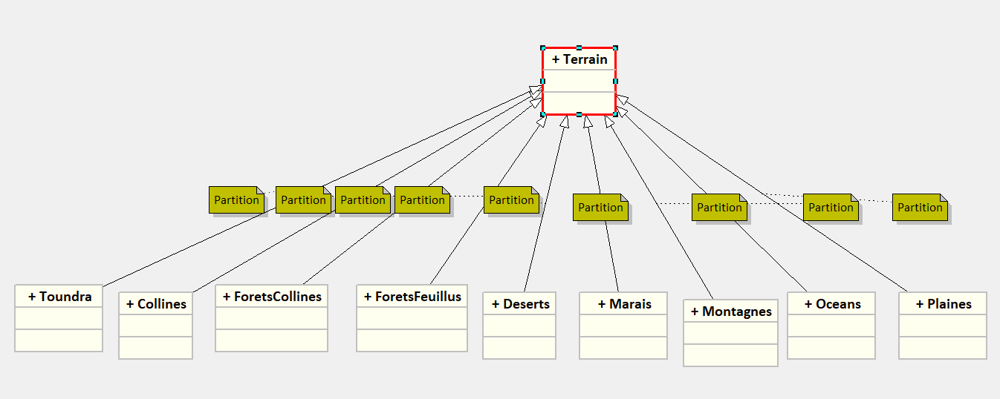

# Note

**AMIRI Anas**
**[amiria@3il.fr](amiria@3il.fr)**

/* A REVOIR !!! */ : cette ligne de commentaire sera utiliser comme mot clé de
recherche pour trouver plus facilement le code ou je ne suis pas sûr, 
bien évidemment cela sera enlever lors de la livraison

J'ai bien aimé ce projet il m'a permit de mieux manipuler git et cela me servira en entreprise mais aussi pour mes projet
perso, il m'a permit aussi d'améliorer ma capacité d'analyse de code.
Je n'ai pas trop aimé comment été rédigé le README.md original j'avoue avoir eu quelque dificulté à comprendre l'énoncé

-----------------------------------------------------------------
# Les Question

## Pourquoi l'attribut graine est-il en final ?

L'attribut graine doit être en final car la graine doit être unique elle ne
pas être modifier ou modifiable, la graine et le code qui permet de générer le
bruit si la graine change le bruit change également

Réaliser l'architecture que prendrait la forme d'une telle modélisation sous forme d'un diagramme UML. Quelle serait la différence d'attributs et de méthodes entre ces classes ? Expliquer, en s'appuyant sur un exercice vu en cours, pourquoi c'est une mauvaise idée. Quelle est la solution qu'il faudrait préférer (et que l'on va préférer) ?

c'est une mauvaise idée car le jour on l'on veux ajouter un nouveux type de terrain cela pourrais être compliquer et long à implémenter, il est donc
préférable d'utiliser les enum car l'ajout ou la suppresion de terrain est plus simple

## Quel type utilisez-vous ?

On utilise le type double car il permet d'avoir une plus grande précision que le float pour les attributs du terrain

## Pourquoi sortir, selon vous, ce bout d'algorithme de la classe ?

Pour moi cela permettra de d'ajouter plus facilement de nouvelle méthode, mais également d'avoir un couplage équilibré

-----------------------------------------------------------------
